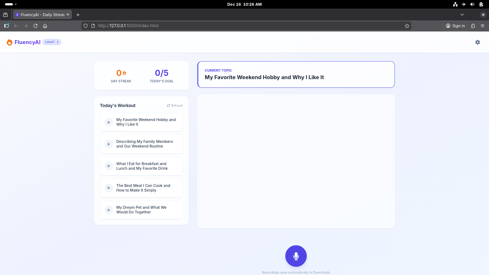

# FluencyAI 🎙️

**FluencyAI** is a browser-based, AI-powered English tutor designed to help students improve their speaking fluency, reduce hesitation ("umms" and "ahhs"), and build a consistent daily practice habit. 

Unlike standard chatbots that only read text, FluencyAI listens to your **real voice recording**, analyzes your tone and pronunciation, and provides specific feedback using Google's multimodal Gemini models.



## ✨ Key Features

* **🗣️ Pro Voice Analysis:** Records raw audio via the browser's `MediaRecorder` API and sends it directly to Gemini. The AI detects hesitation, filler words, and pronunciation errors that text-to-speech misses.
* **🔥 Gamification System:**
    * **Daily Streaks:** Tracks consecutive days of practice.
    * **Leveling System:** Progress from **Beginner** to **Advanced**.
    * **Daily Workout:** Generates 5 unique topics every day based on your current level.
* **💾 Auto-Save Audio:** Every practice session is automatically downloaded to your local `Downloads` folder with organized filenames (e.g., `FluencyAI_L1_My_Favorite_Hobby.webm`).
* **🔒 Privacy First:** * No backend server required.
    * Your API Key is stored locally in your browser (`localStorage`).
    * Audio files stay on your machine.
* **⚡ Lightweight:** Built with vanilla JavaScript and Tailwind CSS via CDN. No build steps required.

## 🛠️ Tech Stack

* **Frontend:** HTML5, JavaScript (ES6 Modules)
* **Styling:** Tailwind CSS (CDN)
* **AI Model:** Google Gemini API (`gemini-flash-latest` for high rate limits)
* **SDK:** Google Generative AI SDK for JavaScript

## 🚀 Getting Started

### Prerequisites
1.  A modern web browser (Chrome, Edge, or Brave recommended for best microphone support).
2.  A **Google Gemini API Key**. You can get one for free at [Google AI Studio](https://aistudio.google.com/).

### Installation

1.  **Clone the repository:**
    ```bash
    git clone https://github.com/soul-999-ayu/FluencyAI.git
    cd FluencyAI
    ```

2.  **Run the app:**
    * Simply open `index.html` in your browser.
    * *Recommended:* Use a local server (like VS Code's "Live Server" extension) to avoid browser security restrictions regarding microphone access.

3.  **Configure API Key:**
    * Click the **Settings (Gear Icon)** in the top right.
    * Paste your Gemini API Key.
    * Click **Save**.

## 🎮 How to Use

1.  **Check Your Daily Plan:** On the left sidebar, you will see 5 topics generated for today.
2.  **Select a Topic:** Click on a card (e.g., "My favorite hobby").
3.  **Record:** Click the **Microphone** button. Speak clearly for 10-60 seconds.
4.  **Stop & Analyze:** Click the stop button. The app will:
    * Automatically download your recording.
    * Send the audio to Gemini.
    * Display feedback on your fluency and grammar.
5.  **Level Up:** Complete all 5 topics to boost your streak!

## ⚠️ Troubleshooting

**"Quota Exceeded / 429 Error"**
If you see an error about quotas, it means you hit the daily limit for the specific AI model.
* **Fix:** The code is currently set to use `gemini-flash-latest`, which has a high free tier limit (1,500 requests/day). Ensure your API key is from a project with billing enabled (optional) or simply wait for the quota to reset.

**"Microphone Not Working"**
* Ensure you are using `localhost` or `https`. Browsers often block microphone access on `file://` paths for security.
* Check browser permissions to allow microphone access.

## 🤝 Contributing

Contributions are welcome! Feel free to open an issue or submit a pull request if you have ideas for new gamification features or UI improvements.

## 📄 License

This project is open-source and available under the [MIT License](LICENSE).

---

*Built with ❤️ by Ayu Kashyap using Google Gemini API.*